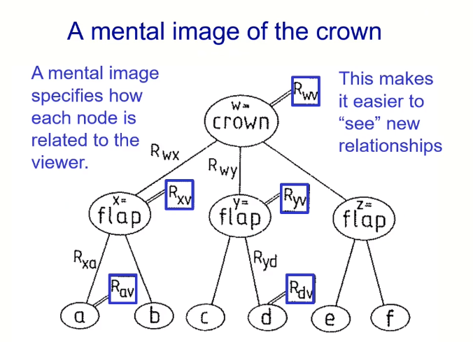
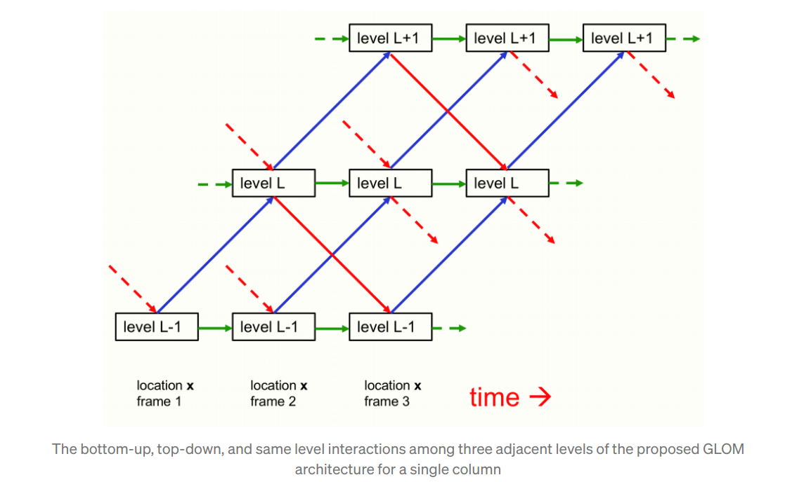
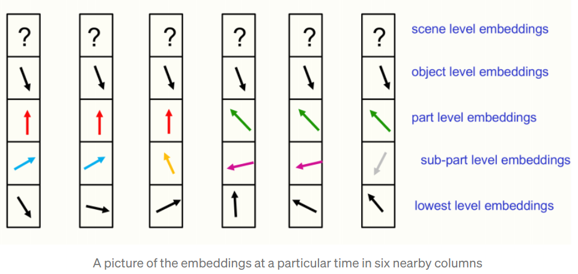

# Part-Whole Hierarchies in a Neural Net

## Recent advances

* Transformer
* Unsupervised learning via agreement
* Generative models

## Ideas

* Alternative representation of the same thing
* The alternative percepts do not disagree but they make different facts obvious.
* Both DNN and CNN don't have _alternative presentation_

$=>$ Represent as tree or graph, i.e. structral description

## Issues

Neural network cannot represent parse tree

* Weight change too slow
* Need strong sparsity

## How

1. Transformer and attention
2. Contrastive self-supervised learning: a patch of object contain A and B, another patch contain A and C, the network become confusing on which features are relevant for B or C.

### GLOM

Agreement output vectors from different patches as an objective function (i.e. kind of location embedding, find features coherent).

* Symbolic AI: create a parse tree, allocate note and edges
* Capsules: _permanently allocate_ a piece of neural hardware for each possible node. For each image, only activate a small subset of possible nodes, and use dynamic routing to activate connections between whole and part nodes.
* GLOM: allocate embedding vectors to notes (object) in the parse tree. Replicating (Use identical) vectors for all locations occupied by that node (object) (hard constraint tie the node weights)

For example, cell has a complete set of instructions for making proteins, cell is autonomous and environmental dependence.

#### Implementation

Averaging embedding from near by locations, within the same level.

Neural network learn to make agreement between parts to create the whole.

A problem with making an object vector the same for all columns occupied by the object is _same face vector must make different top-down predictions for columns occupied by the nose and another for the mounth_

$=>$ using _neural fields_ solve this problem:

* Top-down neural net receives an extra input representing the image location of the column.
* The pose of the face plus this extra input tell it which part should occupyh that column.

Level L embedding in column x tries to agree with same level of another column y.

* Level L embedding attention-weighted average $exp(L(x)L(y))$.
* Level L form local islands of similar embedding (echo chambers).

Training similar to BERT, filling missing regions.

