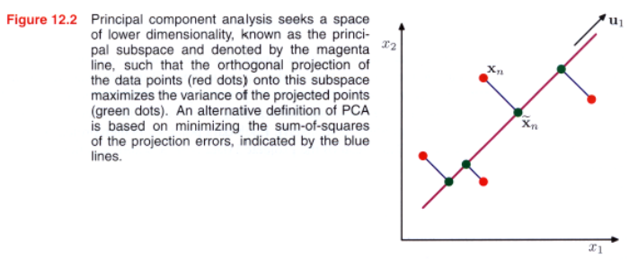

# PCA: Principal Component analysis

#tag dimension reduction
#tag variance
#tag eigenvectors

Probabilistic, auto-encoder and manifold of representation learning.

$$ h = f(x) = \mathbf{W}^Tx + b $$

where: $x \in \mathbb{R}^{d_x}$ and $W \in \mathbb{R}^{d_x \times d_h}$

The learned representation is:

* Orthogonal vectors
* Same as basic linear auto-encoder
* Manifold characterizing a lower-dimensional region in input space near which the data density is peaked

> Conventional PCA will assign a low reconstruction cost to data points that are close to the principal subspace even if they lie arbitrarily far from the training data.

## Probabilistic PCA

Linear Gaussian framework, marginal distribution is Gaussian and conditional distribution is Gaussian.

$$
p(h)=\mathcal{N}(h;0,\sigma^2_h\mathbb{I})\\
p(x|h)=\mathcal{N}(x;\mathbf{W}h+\mu_x,\sigma_x^2\mathbb{I})
$$

From generative viewpoint $x=\mathbf{W}h + \mu_x + \epsilon$, where $\epsilon = \mathcal{N}(0, \sigma_x^2\mathbb{I})$
### Advantages:

* EM algorithm for PCA that is computationally efficient
* Probabilistic model and EM allows us to deal with missing values in the data set.
* A Bayesian treatment of PCA in which the dimensionality of the principal subspace can be found automatically from the data.
* Likelihood function allows direct comparison with other probabilistic density models.
* Model class-conditional densities and hence be applied to classification problems.
* The probabilistic PCA model can be run generatively to provide samples from the distribution.
